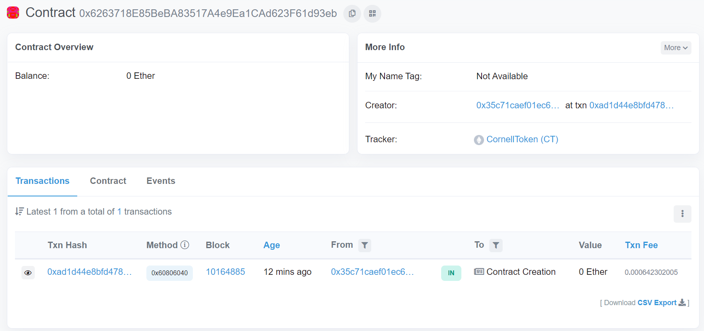

# Create Basic ERC20 token with Solidity, Brownie and Python

## Demo
Check out [Cornell Token](https://rinkeby.etherscan.io/address/0x6263718E85BeBA83517A4e9Ea1CAd623F61d93eb) on Rinnkeby network with Etherscan. 



## Installation

1. Install [brownie](https://eth-brownie.readthedocs.io/en/stable/) with pipx
    
    ```bash
    $ python3 -m pip install --user pipx
    $ python3 -m pipx ensurepath
    $ pipx install eth-brownie

    # test installation
    $ brownie 
    ```

2. [Install ganache-cli](https://www.npmjs.com/package/ganache-cli) with npm

    ```bash
    npm install -g ganache-cli
    ```

## Create the Project
    
1. Initialize the project
    
    ```bash
    $ mkdir cornell_token ; cd cornell_token
    $ brownie init
    ```
    
2. Create token contract in `./contracts/CornellToken.sol` 
    - inherit ERC20 implementation from [OpenZeppelin](https://docs.openzeppelin.com/contracts/4.x/erc20) to avoid re-inventing the wheel. 
3. Add `./brownie-config.yaml`
    1. create mapping `@openzeppelin` to the github repo
    2. add other config:
       - dotenv
       - private key of local dev
5. Add `.env` for the environment variables
    - dotenv  -> for private key stuff, as a safer way
6. Change the name of the Token (e.g. `CornellToken`)
7. Creat deploy script `deploy_cornell_token.py`
    - define initial supply, token name, token sybol
8. Creat deploy script `helper.py`
    - get account function


## Deploy to local blockchain development environment
```bash
$ brownie run scripts/deploy_cornell_token.sol
```

## Deploy to live network
1. in `brownie-config.yaml`, add:
    ```yaml
    networks:
    rinkeby: active
    ```

2. in `.env`, add:
    ```env
    export WEB3_INFURA_PROJECT_ID=<YOUR INFURA PROJECT ID>
    export PRIVATE_KEY=<YOUR PRIVATE KEY>
    ```
    <br>
    To have infura project id, you need to create an infura account and a new project. The id is the endpoint to the live network.
    <br> <br>
    To access your private key, you can check out the metamask -> account details
    <br> <br>

3. run the same script with an extra `--network` option
    ```bash
    $ brownie run scripts/deploy_cornell_token.sol --network rinkeby
    ```
    then wait for a moment to see the address being active on the live network.


4. add this token to metamask
    - Metamask -> assets -> import tokens
    - grab the token contract address and add it into metamask.


